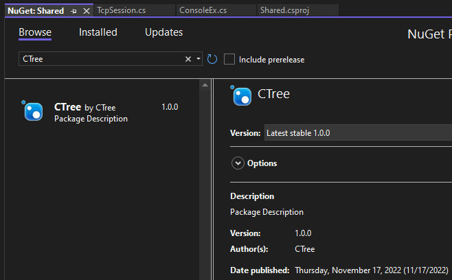
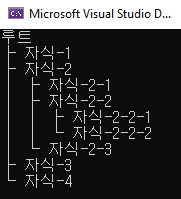
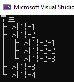
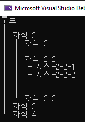
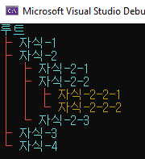

### 0. <a href="#_0" id="li_0">다운로드</a>
### 1. <a href="#_1" id="li_1">시작 배경</a>
### 2. <a href="#_2" id="li_2">개발 환경</a>
### 3. <a href="#_3" id="li_3">사용 방법</a>  
   1. <a href="#_3_1" id="li_3_1">기본 예제</a>
   1. <a href="#_3_2" id="li_3_2">Folding 예제</a>
   1. <a href="#_3_3" id="li_3_3">Dummy 예제</a>
   1. <a href="#_3_4" id="li_3_4">색상 변경 예제</a>


<br>
<br>
<br>
<br>

## 0. 다운로드 <a href="#_0" id="_0"></a>
nuget에서 CTree 검색 후 다운로드하면 됨.  



<br>
<br>
<br>

## 1. 시작 배경 <a href="#_1" id="_1"></a>

[Tcp 홀펀칭 구현](https://github.com/yjd6808/_YJD_TcpDiggingHole)을 하면서 콘솙창에 트리 구조의 메뉴를 출력하다가
옛날에 cmd에서 tree 명령을 치던 기억이 떠올라서 만들게 되었다.  
만드는데 3시간밖에 안걸린 작은 프로젝트인데 정리하고 인생 첫 nuget 패키지 배포를 한다고 몇시간이 더걸렸다.

<br>
<br>
<br>


## 2. 개발 환경 <a href="#_2" id="_2"></a>

비주얼스튜디오 2022 .Net 6.0  
바로 실행해보고 싶으면 비주얼 스튜디오로 CTree.sln을 연 후  
CTreeTest 프로젝트를 선택해서 F5를 눌러서 실행하면 됨.

```
CTree: 콘솔에서 트리형식의 출력을 지원해주는 라이브러리  
CTreeTest: CTree 라이브러리 테스트용 콘솔 프로젝트
```

<br>
<br>
<br>


## 3. 사용 방법<a href="#_3" id="_3"></a>

<br>

### 1. <b>[기본 예제]</b><a href="#_3_1" id="_3_1"></a>

```csharp
ConsoleTree root = new ConsoleTree("루트");

ConsoleTreeItem child1 = new("자식-1");
ConsoleTreeItem child2 = new("자식-2");

{
   ConsoleTreeItem child21 = new("자식-2-1");
   ConsoleTreeItem child22 = new("자식-2-2");

   {
      ConsoleTreeItem child221 = new("자식-2-2-1");
      ConsoleTreeItem child222 = new("자식-2-2-2");
      child22.Add(child221, child222);
   }
   ConsoleTreeItem child23 = new("자식-2-3");
   child2.Add(child21, child22, child23);
}

ConsoleTreeItem child3 = new("자식-3");
ConsoleTreeItem child4 = new("자식-4");
root.Add(child1, child2, child3, child4);
root.Print();


/* 동일한 출력 빌더 버전
var root = new ConsoleTree("루트");
root.Add("자식-1")
    .AddReturnChild("자식-2")
        .Add("자식-2-1")
        .AddReturnChild("자식-2-2")
            .Add("자식-2-2-1")
            .AddReturnParent("자식-2-2-2")
        .AddReturnParent("자식-2-3")
    .Add("자식-3")
    .Add("자식-4");
root.Print();
*/
```


<br>




<br>
<br>

### 2. <b>[Folding 예제]</b><a href="#_3_2" id="_3_2"></a>

Fold 옵션을 주게되면 하위 자식들이 출력되지 않는다.
아래 예시를 보면 자식-2-2에 Fold 옵션을 주게되면 2-2-1 ~ 2-2-3의 자식들이 출력이 안되는 것을 확인할 수 있다.

```c#
ConsoleTree root = new ConsoleTree("루트");

ConsoleTreeItem child1 = new("자식-1");
ConsoleTreeItem child2 = new("자식-2");

{
   ConsoleTreeItem child21 = new("자식-2-1");
   ConsoleTreeItem child22 = new("자식-2-2") { Fold = true };

   {
      ConsoleTreeItem child221 = new("자식-2-2-1");
      ConsoleTreeItem child222 = new("자식-2-2-2");
      child22.Add(child221, child222);
   }
   ConsoleTreeItem child23 = new("자식-2-3");
   child2.Add(child21, child22, child23);
}

ConsoleTreeItem child3 = new("자식-3");
ConsoleTreeItem child4 = new("자식-4");
root.Add(child1, child2, child3, child4);
root.Print();


/* 동일한 출력 빌더 버전
var root = new ConsoleTree("루트");
root.Add("자식-1")
    .AddReturnChild("자식-2")
        .Add("자식-2-1")
        .AddReturnChild(new ConsoleTreeItem("자식-2-2") { Fold = true })
            .Add("자식-2-2-1")
            .AddReturnParent("자식-2-2-2")
        .AddReturnParent("자식-2-3")
    .Add("자식-3")
    .Add("자식-4");
root.Print();
*/


```




<br>
<br>

### 3. <b>[Dummy 예제]</b><a href="#_3_3" id="_3_3"></a>

Dummy 옵션을 주게 되면 해당 아이템이 있던 행은 유지한채로 안보이게 만들어줌
물론 하위 자식들도 출력되지 않는다.  

기존 아이템을 더미로 만들어 버릴수도 있고 AddDummy(int count)  
함수를 사용해서 사이사이 원하는 수만큼 더미를 추가할 수도 있다.

1. 자식-1이 Dummy 처리되어 출력되지 않고 있다.
2. 자식 2-1과 자식 2-2사이에 1개의 더미노드가 추가되었다.
3. 자식 2-2와 자식 2-3사이에 2개의 더미노드가 추가되었다.

```c#
ConsoleTree root = new ConsoleTree("루트");

ConsoleTreeItem child1 = new("자식-1") { Dummy = true }; // 더미로 만들어버릴 수 있음
ConsoleTreeItem child2 = new("자식-2");  

{
    ConsoleTreeItem child21 = new("자식-2-1");
    ConsoleTreeItem child22 = new("자식-2-2");

    {
        ConsoleTreeItem child221 = new("자식-2-2-1");
        ConsoleTreeItem child222 = new("자식-2-2-2");
        child22.Add(child221, child222);
    }
    ConsoleTreeItem child23 = new("자식-2-3");
    child2.Add(child21);
    child2.AddDummy();
    child2.Add(child22);
    child2.AddDummy(2);
    child2.Add(child23);
}

ConsoleTreeItem child3 = new("자식-3");
ConsoleTreeItem child4 = new("자식-4");
root.Add(child1, child2, child3, child4);
root.Print();


/* 동일한 출력 빌더 버전
var root = new ConsoleTree("루트");
root.Add(new ConsoleTreeItem("자식-1") { Dummy = true })
    .AddReturnChild("자식-2")
        .Add("자식-2-1")
        .AddDummy()
        .AddReturnChild("자식-2-2")
            .Add("자식-2-2-1")
            .AddReturnParent("자식-2-2-2")
        .AddDummy(2)
        .AddReturnParent("자식-2-3")
    .Add("자식-3")
    .Add("자식-4");
root.Print();
*/

```





<br>
<br>

### 4. <b>[색상 변경 예제]</b><a href="#_3_4" id="_3_4"></a>

1. 트리 전체 브릿지, 아이템 색상 변경 가능
2. 트리 개별 아이템 색상 변경 가능


```c#
ConsoleTree root = new("루트")
{
    ItemForegroundColor = ConsoleColor.Cyan,        // 전체 아이템 색상, 브릿지 색상 변경가능
    BridgeForegroundColor = ConsoleColor.Red
};

ConsoleTreeItem child1 = new("자식-1");
ConsoleTreeItem child2 = new("자식-2");

{
    ConsoleTreeItem child21 = new("자식-2-1");
    ConsoleTreeItem child22 = new("자식-2-2");

    {
        // 개별 아이템 색상 변경도 가능
        ConsoleTreeItem child221 = new("자식-2-2-1") { ForegroundColor = ConsoleColor.DarkYellow };
        ConsoleTreeItem child222 = new("자식-2-2-2") { ForegroundColor = ConsoleColor.DarkYellow };
        child22.Add(child221, child222);
    }
    ConsoleTreeItem child23 = new("자식-2-3");
    child2.Add(child21, child22, child23);
}

ConsoleTreeItem child3 = new("자식-3");
ConsoleTreeItem child4 = new("자식-4");
root.Add(child1, child2, child3, child4);
root.Print();
```


